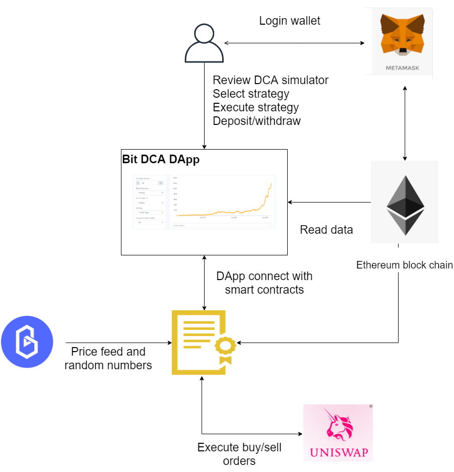
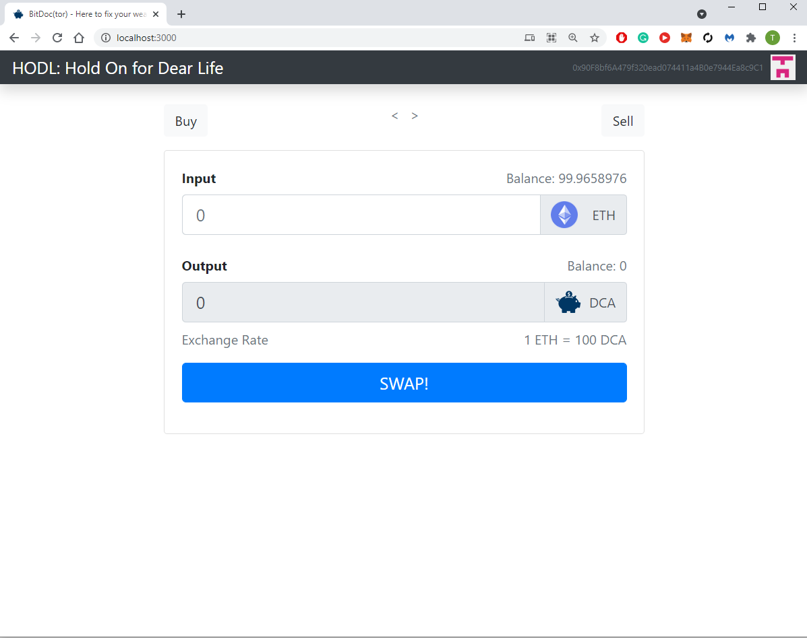

# BitDoc
BitDoc(tor) - is here to fix your wealth
This repo is  a basic setup for token exhange contract (DCA token) part of Blockathon 2021

source repos: https://github.com/dappuniversity/eth_swap

# DApp diagram



# DApp exchange



# Local dev scripts 
```
ganache-cli --deterministic -p 7545 -i 5777 --chainId 5777 --acctKeys 

npm run start

truffle migrate

truffle console

truffle migrate --reset

```
# timelock contracts
https://www.toptal.com/ethereum-smart-contract/time-locked-wallet-truffle-tutorial


# scheduling, cron jobs
https://blog.chronologic.network/how-to-prove-day-ownership-to-be-a-timenode-3dc1333c74ef


# Openzepplin installation
```
npm install openzeppelin-solidity --save-dev
```